# 🛡️ SafeNAS
> PowerShell script that keeps your NAS protected — detecting antivirus malfunctions through automated EICAR testing

[](https://github.com/PowerShell/PowerShell)
[](LICENSE)
[]()

---

## 📖 Description

**SafeNAS** is a PowerShell monitoring script that continuously tests antivirus protection on network shares (NAS/UNC paths). It automatically deploys **EICAR test files** to verify that your antivirus is actively scanning and removing threats in real-time.

### ✨ Key Features

- 🔄 **Automated continuous monitoring** of multiple network shares
- 📝 **Detailed logging** with timestamps and severity levels
- 📧 **Email alerts** via SMTP (TLS/SSL support)
- 🔔 **Visual popup alerts** for immediate notification
- 🔐 **Secure password handling** with PowerShell SecureString
- 🌐 **Multi-protocol SMTP support** (TLS/STARTTLS/SSL)
- 🛠️ **Easy configuration** - all settings in one section

---

## 🚀 Quick Start

### Prerequisites

- Windows PowerShell 5.1 or higher
- Network access to UNC paths to monitor
- SMTP server credentials for email notifications
- Appropriate permissions to write to network shares

### Installation

1. Download the script:
```powershell
# Clone or download the script file
Invoke-WebRequest -Uri "[https://github.com/jbianco-prog/SafeNAS/SafeNAS.ps1](https://github.com/jbianco-prog/SafeNAS/SafeNAS.ps1)" -OutFile "SafeNAS.ps1"
```

2. Edit the configuration section (lines 12-66):
```powershell
# Network paths to monitor
$uncPaths = @(
    "\\192.168.1.60\Share1",
    "\\192.168.1.60\Share2"
)

# Email configuration
$adminEmail = "admin@example.com"
$emailFrom = "monitoring@example.com"

# SMTP settings
$smtpServer = "smtp.example.com"
$smtpPort = 587
$smtpUser = "smtp-user@example.com"
$smtpPassword = "YourPassword"
```

3. Run the script:
```powershell
.\SafeNAS.ps1
```

---

## ⚙️ How It Works

```mermaid
graph LR
    A[Start] --> B[Create EICAR file]
    B --> C[Wait X seconds]
    C --> D{File deleted?}
    D -->|Yes| E[✅ Antivirus OK]
    D -->|No| F[❌ Alert: AV Failed]
    F --> G[Show Popup]
    F --> H[Send Email]
    F --> I[Log Error]
    E --> J[Log Success]
    G --> K[Delete file manually]
    H --> K
    I --> K
    J --> L[Next path or wait]
    K --> L
    L --> B
```



### Process Flow

1. **File Creation**: Script creates a random EICAR test file on the target share
2. **Wait Period**: Allows antivirus time to detect and delete the file
3. **Verification**: Checks if the file still exists
4. **Alert Mechanism**: If file persists (AV failure):
   - 📝 Logs the error with timestamp
   - 🔔 Displays a popup warning
   - 📧 Sends email notification to administrator
   - 🗑️ Manually deletes the test file
5. **Loop**: Process repeats for all configured paths, then waits before next cycle

---

## 🧰 Configuration Parameters

### Network & Timing

| Variable | Description | Default | Example |
|----------|-------------|---------|---------|
| `$uncPaths` | Array of UNC paths to monitor | Required | `@("\\server\share1", "\\nas\backup")` |
| `$intervalMinutes` | Interval between test cycles (minutes) | `5` | `10` (every 10 minutes) |
| `$waitAfterWriteSeconds` | Wait time after file creation (seconds) | `2` | `20` (wait 20 seconds) |

### Logging

| Variable | Description | Default |
|----------|-------------|---------|
| `$logFile` | Path to log file | `.\AVTestLog.txt` |

### Email Notification

| Variable | Description | Example |
|----------|-------------|---------|
| `$adminEmail` | Recipient email address | `"admin@example.com"` |
| `$emailFrom` | Sender email address | `"monitoring@example.com"` |
| `$emailSubject` | Email subject line | `"Antivirus not working - File not deleted"` |

### SMTP Configuration

| Variable | Description | Default | Notes |
|----------|-------------|---------|-------|
| `$smtpServer` | SMTP server hostname | Required | `"smtp.ionos.fr"` |
| `$smtpPort` | SMTP port number | `587` | 587=TLS, 465=SSL, 25=Clear |
| `$smtpUser` | SMTP username | Required | Usually full email address |
| `$smtpPassword` | SMTP password (plain text) | Required | Converted to SecureString |
| `$smtpUseTLS` | Enable TLS encryption | `$true` | For port 587 (STARTTLS) |
| `$smtpUseSSL` | Enable SSL encryption | `$false` | For port 465 |
| `$smtpTimeout` | Connection timeout (ms) | `30000` | 30 seconds |

### SMTP Configuration Examples

**For IONOS with TLS (Recommended):**
```powershell
$smtpServer = "smtp.ionos.fr"
$smtpPort = 587
$smtpUseTLS = $true
$smtpUseSSL = $false
```

**For Gmail with SSL:**
```powershell
$smtpServer = "smtp.gmail.com"
$smtpPort = 465
$smtpUseTLS = $false
$smtpUseSSL = $true
```

**For Office 365:**
```powershell
$smtpServer = "smtp.office365.com"
$smtpPort = 587
$smtpUseTLS = $true
$smtpUseSSL = $false
```

---

## 📧 Email Alert Example

When an antivirus failure is detected, you receive an email like this:

```text
Subject: Antivirus not working - File not deleted

Hello,

The EICAR test file was not deleted from the following path after 2 seconds:

Path: \\192.168.1.60\Share1\EICAR_847263.txt
Date: 16/10/2025 16:35:42

Please check that your antivirus or security system is working properly.

Sincerely,
The monitoring script
```

---

## 📋 Log File Format

The script creates a detailed log file (`AVTestLog.txt`) with entries like:

```text
16/10/2025_16:35:40 :: START :: ### Begin antivirus test script for NAS ###
16/10/2025_16:35:40 :: START :: Script started - Testing 2 network paths
16/10/2025_16:35:40 :: INFO :: Configuration: Check interval = 5 min, Wait after write = 2 sec
16/10/2025_16:35:40 :: INFO :: ### Starting new test cycle ###
16/10/2025_16:35:40 :: INFO :: Testing path 1/2: \\192.168.1.60\Share1
16/10/2025_16:35:40 :: INFO :: EICAR file written: \\192.168.1.60\Share1\EICAR_847263.txt
16/10/2025_16:35:42 :: SUCCESS :: Antivirus status \\192.168.1.60\Share1 : Active
16/10/2025_16:35:42 :: INFO :: Testing path 2/2: \\192.168.1.60\Share2
16/10/2025_16:35:42 :: INFO :: EICAR file written: \\192.168.1.60\Share2\EICAR_923847.txt
16/10/2025_16:35:44 :: ERROR :: Antivirus status \\192.168.1.60\Share2 : NOT ACTIVE
16/10/2025_16:35:44 :: DEBUG :: Attempting to send email to admin@example.com
16/10/2025_16:35:45 :: SUCCESS :: Email successfully sent to admin@example.com via smtp.ionos.fr:587 (TLS)
16/10/2025_16:35:45 :: INFO :: ### Test cycle completed ###
```

### Log Levels

- **START**: Script initialization
- **INFO**: General information
- **SUCCESS**: Antivirus working correctly
- **ERROR**: Antivirus failure detected
- **DEBUG**: Technical details (SMTP, etc.)
- **WARNING**: Non-critical issues

---

## 🔧 Advanced Usage

### Running as a Windows Service

To run SafeNAS continuously in the background, create a scheduled task:

```powershell
# Create a scheduled task to run at startup
$action = New-ScheduledTaskAction -Execute "PowerShell.exe" -Argument "-ExecutionPolicy Bypass -File C:\Scripts\SafeNAS.ps1"
$trigger = New-ScheduledTaskTrigger -AtStartup
$principal = New-ScheduledTaskPrincipal -UserId "SYSTEM" -LogonType ServiceAccount -RunLevel Highest
Register-ScheduledTask -TaskName "SafeNAS-Monitor" -Action $action -Trigger $trigger -Principal $principal
```

### Customizing the Email Template

Edit the `$emailTemplate` variable to customize the notification message:

```powershell
$emailTemplate = @"
⚠️ SECURITY ALERT ⚠️

Antivirus failure detected on network share!

Location: {0}
Detection time: {1}
Severity: CRITICAL

Action required: Verify antivirus service status immediately.

This is an automated message from SafeNAS.
"@
```

### Testing Without Waiting

For quick testing, temporarily reduce the wait times:

```powershell
$intervalMinutes = 1           # Test every 1 minute
$waitAfterWriteSeconds = 5     # Wait only 5 seconds
```

---

## 🐛 Troubleshooting

### Common Issues

**1. Email not sending**
```
ERROR :: Failed to send email via SMTP: Authentication failed
```
**Solution:** 
- Verify SMTP credentials are correct
- Check if 2FA is enabled (use app password)
- Confirm firewall allows outbound SMTP traffic

**2. Access denied to network share**
```
ERROR :: Error processing path '\\server\share': Access denied
```
**Solution:**
- Verify you have write permissions to the UNC path
- Check if the share is accessible from the machine running the script
- Try mapping the drive manually first

**3. EICAR file not being deleted (False positive)**
```
ERROR :: Antivirus status \\server\share : NOT ACTIVE
```
**Solution:**
- Increase `$waitAfterWriteSeconds` value
- Verify antivirus is actually running on the server
- Check antivirus logs for scan activity

---

## 📊 Best Practices

✅ **Do:**
- Test the script on a single share first
- Use a dedicated service account with minimal permissions
- Monitor the log file regularly
- Set `$intervalMinutes` to a reasonable value (5-15 minutes)
- Use TLS/SSL for SMTP connections
- Store the script in a secure location

❌ **Don't:**
- Run with Domain Admin credentials
- Set `$intervalMinutes` too low (< 2 minutes)
- Ignore repeated alerts
- Share SMTP passwords in plain text files
- Test on production shares without IT approval

---

## 📜 What is EICAR?

The **EICAR test file** is a standard used to test antivirus software without using actual malware. It's a 68-byte text file recognized by all antivirus software as a "virus" but is completely harmless.

```
X5O!P%@AP[4\PZX54(P^)7CC)7}$EICAR-STANDARD-ANTIVIRUS-TEST-FILE!$H+H*
```

More info: [EICAR.org](https://www.eicar.org/)

---

## 🤝 Contributing

Contributions are welcome! Please:

1. Fork the repository
2. Create a feature branch (`git checkout -b feature/improvement`)
3. Commit your changes (`git commit -am 'Add new feature'`)
4. Push to the branch (`git push origin feature/improvement`)
5. Open a Pull Request

---

## 📄 License

This project is licensed under the GPL License - see the [LICENSE](https://github.com/jbianco-prog/SafeNAS/blob/master/LICENSE_GPL.md) file for details.

---

## 👨‍💻 Author

**Micro-one**
- Website: [micro-one.com](https://micro-one.com)
- Email: contact@micro-one.com

---

## 🔗 Related Projects

- [EICAR Test Files](https://www.eicar.org/) - Standard antivirus test files

---

## ⭐ Support

If you find this script useful, please consider:
- ⭐ Starring the repository
- 🐛 Reporting issues
- 💡 Suggesting improvements
- 📢 Sharing with others

---

**Last updated:** October 16, 2025  
**Version:** 3.1, built by humans augmented by AI
**Tested on:** Windows Server 2019/2022, Windows 10/11
