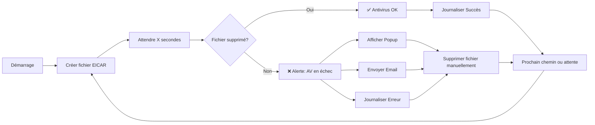

# 🛡️ SafeNAS
> Script PowerShell qui protège vos NAS — détection des dysfonctionnements antivirus par tests automatisés EICAR

[](https://github.com/PowerShell/PowerShell)
[](LICENSE)
[]()

---

## 📖 Description

**SafeNAS** est un script de surveillance PowerShell qui teste en continu la protection antivirus sur les partages réseau (NAS/chemins UNC). Il déploie automatiquement des **fichiers de test EICAR** pour vérifier que votre antivirus analyse et supprime activement les menaces en temps réel.

### ✨ Fonctionnalités Principales

- 🔄 **Surveillance continue automatisée** de plusieurs partages réseau
- 📝 **Journalisation détaillée** avec horodatage et niveaux de gravité
- 📧 **Alertes email** via SMTP (support TLS/SSL)
- 🔔 **Alertes popup visuelles** pour notification immédiate
- 🔐 **Gestion sécurisée des mots de passe** avec PowerShell SecureString
- 🌐 **Support multi-protocoles SMTP** (TLS/STARTTLS/SSL)
- 🛠️ **Configuration facile** - tous les paramètres dans une seule section

---

## 🚀 Démarrage Rapide

### Prérequis

- Windows PowerShell 5.1 ou supérieur
- Accès réseau aux chemins UNC à surveiller
- Identifiants serveur SMTP pour les notifications email
- Permissions appropriées pour écrire sur les partages réseau

### Installation

1. Téléchargez le script :
```powershell
# Clonez ou téléchargez le fichier script
Invoke-WebRequest -Uri "https://raw.githubusercontent.com/jbianco-prog/SafeNAS/refs/heads/master/SafeNAS.ps1" -OutFile "SafeNAS.ps1"
```

2. Éditez la section configuration (lignes 12-66) :
```powershell
# Chemins réseau à surveiller
$uncPaths = @(
    "\\192.168.1.60\Partage1",
    "\\192.168.1.60\Partage2"
)

# Configuration email
$adminEmail = "admin@exemple.com"
$emailFrom = "surveillance@exemple.com"

# Paramètres SMTP
$smtpServer = "smtp.exemple.com"
$smtpPort = 587
$smtpUser = "smtp-user@exemple.com"
$smtpPassword = "VotreMotDePasse"
```

3. Exécutez le script :
```powershell
.\SafeNAS.ps1
```

---

## ⚙️ Fonctionnement



### Flux de Traitement

1. **Création du fichier** : Le script crée un fichier de test EICAR aléatoire sur le partage cible
2. **Période d'attente** : Laisse le temps à l'antivirus de détecter et supprimer le fichier
3. **Vérification** : Vérifie si le fichier existe toujours
4. **Mécanisme d'alerte** : Si le fichier persiste (échec AV) :
   - 📝 Journalise l'erreur avec horodatage
   - 🔔 Affiche une alerte popup
   - 📧 Envoie une notification email à l'administrateur
   - 🗑️ Supprime manuellement le fichier de test
5. **Boucle** : Le processus se répète pour tous les chemins configurés, puis attend avant le prochain cycle

---

## 🧰 Paramètres de Configuration

### Réseau & Timing

| Variable | Description | Défaut | Exemple |
|----------|-------------|--------|---------|
| `$uncPaths` | Tableau des chemins UNC à surveiller | Requis | `@("\\serveur\partage1", "\\nas\backup")` |
| `$intervalMinutes` | Intervalle entre les cycles de test (minutes) | `5` | `10` (toutes les 10 minutes) |
| `$waitAfterWriteSeconds` | Temps d'attente après création du fichier (secondes) | `2` | `20` (attendre 20 secondes) |

### Journalisation

| Variable | Description | Défaut |
|----------|-------------|--------|
| `$logFile` | Chemin du fichier journal | `.\AVTestLog.txt` |

### Notification Email

| Variable | Description | Exemple |
|----------|-------------|---------|
| `$adminEmail` | Adresse email du destinataire | `"admin@exemple.com"` |
| `$emailFrom` | Adresse email de l'expéditeur | `"surveillance@exemple.com"` |
| `$emailSubject` | Ligne d'objet de l'email | `"Antivirus non fonctionnel - Fichier non supprimé"` |

### Configuration SMTP

| Variable | Description | Défaut | Notes |
|----------|-------------|--------|-------|
| `$smtpServer` | Nom d'hôte du serveur SMTP | Requis | `"smtp.ionos.fr"` |
| `$smtpPort` | Numéro de port SMTP | `587` | 587=TLS, 465=SSL, 25=Clair |
| `$smtpUser` | Nom d'utilisateur SMTP | Requis | Généralement l'adresse email complète |
| `$smtpPassword` | Mot de passe SMTP (texte clair) | Requis | Converti en SecureString |
| `$smtpUseTLS` | Activer le chiffrement TLS | `$true` | Pour le port 587 (STARTTLS) |
| `$smtpUseSSL` | Activer le chiffrement SSL | `$false` | Pour le port 465 |
| `$smtpTimeout` | Délai de connexion (ms) | `30000` | 30 secondes |

### Exemples de Configuration SMTP

**Pour IONOS avec TLS (Recommandé) :**
```powershell
$smtpServer = "smtp.ionos.fr"
$smtpPort = 587
$smtpUseTLS = $true
$smtpUseSSL = $false
```

**Pour Gmail avec SSL :**
```powershell
$smtpServer = "smtp.gmail.com"
$smtpPort = 465
$smtpUseTLS = $false
$smtpUseSSL = $true
```

**Pour Office 365 :**
```powershell
$smtpServer = "smtp.office365.com"
$smtpPort = 587
$smtpUseTLS = $true
$smtpUseSSL = $false
```

---

## 📧 Exemple d'Alerte Email

Lorsqu'un échec de l'antivirus est détecté, vous recevez un email comme celui-ci :

```text
Objet : Antivirus non fonctionnel - Fichier non supprimé

Bonjour,

Le fichier de test EICAR n'a pas été supprimé du chemin suivant après 2 secondes :

Chemin : \\192.168.1.60\Partage1\EICAR_847263.txt
Date : 16/10/2025 16:35:42

Veuillez vérifier que votre antivirus ou système de sécurité fonctionne correctement.

Cordialement,
Le script de surveillance
```

---

## 📋 Format du Fichier Journal

Le script crée un fichier journal détaillé (`AVTestLog.txt`) avec des entrées comme :

```text
16/10/2025_16:35:40 :: START :: ### Début du script de test antivirus pour NAS ###
16/10/2025_16:35:40 :: START :: Script démarré - Test de 2 chemins réseau
16/10/2025_16:35:40 :: INFO :: Configuration : Intervalle de contrôle = 5 min, Attente après écriture = 2 sec
16/10/2025_16:35:40 :: INFO :: ### Début d'un nouveau cycle de test ###
16/10/2025_16:35:40 :: INFO :: Test du chemin 1/2 : \\192.168.1.60\Partage1
16/10/2025_16:35:40 :: INFO :: Fichier EICAR écrit : \\192.168.1.60\Partage1\EICAR_847263.txt
16/10/2025_16:35:42 :: SUCCESS :: État antivirus \\192.168.1.60\Partage1 : Actif
16/10/2025_16:35:42 :: INFO :: Test du chemin 2/2 : \\192.168.1.60\Partage2
16/10/2025_16:35:42 :: INFO :: Fichier EICAR écrit : \\192.168.1.60\Partage2\EICAR_923847.txt
16/10/2025_16:35:44 :: ERROR :: État antivirus \\192.168.1.60\Partage2 : NON ACTIF
16/10/2025_16:35:44 :: DEBUG :: Tentative d'envoi d'email à admin@exemple.com
16/10/2025_16:35:45 :: SUCCESS :: Email envoyé avec succès à admin@exemple.com via smtp.ionos.fr:587 (TLS)
16/10/2025_16:35:45 :: INFO :: ### Cycle de test terminé ###
```

### Niveaux de Journal

- **START** : Initialisation du script
- **INFO** : Information générale
- **SUCCESS** : Antivirus fonctionnant correctement
- **ERROR** : Échec de l'antivirus détecté
- **DEBUG** : Détails techniques (SMTP, etc.)
- **WARNING** : Problèmes non critiques

---

## 🔧 Utilisation Avancée

### Exécution en tant que Service Windows

Pour exécuter SafeNAS en continu en arrière-plan, créez une tâche planifiée :

```powershell
# Créer une tâche planifiée à exécuter au démarrage
$action = New-ScheduledTaskAction -Execute "PowerShell.exe" -Argument "-ExecutionPolicy Bypass -File C:\Scripts\SafeNAS.ps1"
$trigger = New-ScheduledTaskTrigger -AtStartup
$principal = New-ScheduledTaskPrincipal -UserId "SYSTEM" -LogonType ServiceAccount -RunLevel Highest
Register-ScheduledTask -TaskName "SafeNAS-Monitor" -Action $action -Trigger $trigger -Principal $principal
```

### Personnalisation du Modèle d'Email

Éditez la variable `$emailTemplate` pour personnaliser le message de notification :

```powershell
$emailTemplate = @"
⚠️ ALERTE SÉCURITÉ ⚠️

Échec de l'antivirus détecté sur le partage réseau !

Emplacement : {0}
Heure de détection : {1}
Gravité : CRITIQUE

Action requise : Vérifier immédiatement l'état du service antivirus.

Ceci est un message automatisé de SafeNAS.
"@
```

### Test Sans Attente

Pour des tests rapides, réduisez temporairement les temps d'attente :

```powershell
$intervalMinutes = 1           # Tester toutes les 1 minute
$waitAfterWriteSeconds = 5     # Attendre seulement 5 secondes
```

---

## 🐛 Dépannage

### Problèmes Courants

**1. Email non envoyé**
```
ERROR :: Échec d'envoi d'email via SMTP : Échec de l'authentification
```
**Solution :** 
- Vérifiez que les identifiants SMTP sont corrects
- Vérifiez si l'authentification à deux facteurs est activée (utilisez un mot de passe d'application)
- Confirmez que le pare-feu autorise le trafic SMTP sortant

**2. Accès refusé au partage réseau**
```
ERROR :: Erreur lors du traitement du chemin '\\serveur\partage' : Accès refusé
```
**Solution :**
- Vérifiez que vous avez les permissions d'écriture sur le chemin UNC
- Vérifiez que le partage est accessible depuis la machine exécutant le script
- Essayez de mapper le lecteur manuellement d'abord

**3. Fichier EICAR non supprimé (Faux positif)**
```
ERROR :: État antivirus \\serveur\partage : NON ACTIF
```
**Solution :**
- Augmentez la valeur de `$waitAfterWriteSeconds`
- Vérifiez que l'antivirus fonctionne réellement sur le serveur
- Consultez les journaux de l'antivirus pour l'activité d'analyse

---

## 📊 Bonnes Pratiques

✅ **À Faire :**
- Tester le script sur un seul partage d'abord
- Utiliser un compte de service dédié avec permissions minimales
- Surveiller régulièrement le fichier journal
- Définir `$intervalMinutes` à une valeur raisonnable (5-15 minutes)
- Utiliser TLS/SSL pour les connexions SMTP
- Stocker le script dans un emplacement sécurisé

❌ **À Ne Pas Faire :**
- Exécuter avec des identifiants d'administrateur de domaine
- Définir `$intervalMinutes` trop bas (< 2 minutes)
- Ignorer les alertes répétées
- Partager les mots de passe SMTP dans des fichiers en texte clair
- Tester sur des partages de production sans approbation IT

---

## 📜 Qu'est-ce qu'EICAR ?

Le **fichier de test EICAR** est un standard utilisé pour tester les logiciels antivirus sans utiliser de véritable malware. C'est un fichier texte de 68 octets reconnu par tous les logiciels antivirus comme un "virus" mais qui est totalement inoffensif.

```
X5O!P%@AP[4\PZX54(P^)7CC)7}$EICAR-STANDARD-ANTIVIRUS-TEST-FILE!$H+H*
```

Plus d'infos : [EICAR.org](https://www.eicar.org/)

---

## 🤝 Contribuer

Les contributions sont les bienvenues ! Veuillez :

1. Forker le dépôt
2. Créer une branche de fonctionnalité (`git checkout -b feature/amelioration`)
3. Commiter vos modifications (`git commit -am 'Ajout d'une nouvelle fonctionnalité'`)
4. Pousser vers la branche (`git push origin feature/amelioration`)
5. Ouvrir une Pull Request

---

## 📄 Licence

Ce projet est sous licence GPL - voir le fichier [LICENSE](https://github.com/jbianco-prog/SafeNAS/blob/master/LICENSE_GPL.md) pour plus de détails.

---

## 👨‍💻 Auteur

**Micro-one**
- Site web : [micro-one.com](https://micro-one.com)
- Email : contact@micro-one.com

---

## 🔗 Projets Connexes

- [Fichiers de Test EICAR](https://www.eicar.org/) - Fichiers de test antivirus standards

---

## ⭐ Support

Si vous trouvez ce script utile, pensez à :
- ⭐ Mettre une étoile au dépôt
- 🐛 Signaler des problèmes
- 💡 Suggérer des améliorations
- 📢 Partager avec d'autres

---

**Dernière mise à jour :** 16 octobre 2025  
**Version :** 3.1 (SafeNAS), conçu par des humains augmentés par l'IA  
**Testé sur :** Windows Server 2019/2022, Windows 10/11
